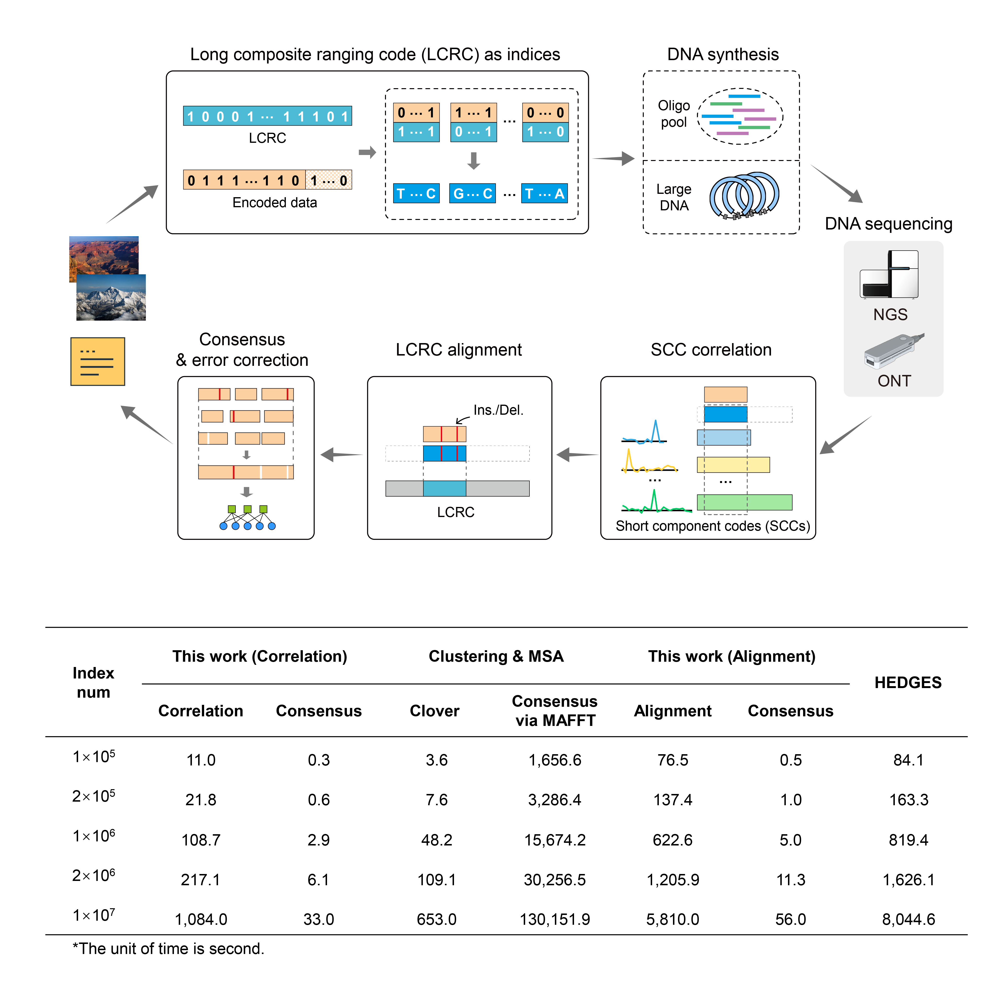

## From Spacecraft Ranging to Massive DNA Data Storage: Composite Ranging Codes as Indices and Error Correction References

The software implements an accompanying indexing and progressive recovery framework with specialized long composite ranging codes (LCRCs) for massive DNA data storage. The LCRC is constructed from a limited number of short component codes (SCCs) of similar lengths and partitioned to index massive DNA strands and to enable progressive error correction using fast correlation and robust alignment. The software is implemented in C/C++ and runs on Linux.
The software supports the following core functions:

1. Encoding and decoding for data storage with oligo pools.
2. Rapid readout from short nanopore reads with read-by-read decoding.
3. Encoding for data storage with large DNA fragments.

<div align="center">

</div>

## Source Data

The source data are available on the Sequence Read Archive (SRA) under accession nos. [SRR33980957](https://www.ncbi.nlm.nih.gov/sra/?term=SRR33980957)–[SRR33980963](https://www.ncbi.nlm.nih.gov/sra/?term=SRR33980963) (SRA Project [PRJNA1276869](https://www.ncbi.nlm.nih.gov/bioproject/PRJNA1276869)), including the Sequencing data generated under different synthesis/sequencing conditions (in FASTQ format):
1. HFS-Pool + NGS (PE150)
2. HFS-Pool + ONT (FAST base calling)
3. HFS-Pool + ONT (FAST base calling) + RT, Nanopore sequencing data for real-time readout verification
4. LCS-Pool + NGS (PE150)  
5. LCS-Pool + ONT (SUP base calling)
6. LCS_D_Pool (Accelerated aging pool) + NGS (PE150)
7. HFS_L_DNA (Large DNA fragment) + NGS (PE150)

## Requirements

Install the following dependencies on Linux:

- cmake
- BWA (https://github.com/lh3/bwa)
- PEAR (https://github.com/tseemann/PEAR)
- feh
- wmctrl

The following open-source C/C++ libraries are used in the software:

- LDPC libraries (https://github.com/radfordneal/LDPC-codes, by Radford M. Neal)
- Edlib (https://github.com/Martinsos/edlib, by Martin Šošić)
- thpool (https://github.com/Pithikos/C-Thread-Pool, by Johan Hanssen Seferidis)

## Build

A pre-compiled version is available in the **_Encoder/bin_** and **_Decoder/bin_** folders

Alternatively, users can compile the C/C++ programs using CMake:

```
# build encoder
cd Encoder && \
mkdir build && \
cd build && \
cmake .. && \
make

# build decoder
cd Decoder && \
mkdir build && \
cd build && \
cmake .. && \
make
```


## Qucik Start

For convenience of evaluation, users can run the integrated shell scripts directly.

#### Function 1: Encoding and decoding for data storage with oligo pools

**1. Encoding**
Navigate to the **_Encoder_** folder and run the encoding process:

```
./run_encoding_oligoPool.sh
```

**2. Decoding**
Navigate to the **_Decoder_** folder.
Decompress the sequencing data generated after paired-end read merging (HFS-Pool + NGS):

```
gzip -d fastq/HFS_Pool_NGS_PEmerged.fastq.gz
```

Run the decoding process:

```
./run_decoding_oligoPool.sh fastq/HFS_Pool_NGS_PEmerged.fastq ${thread} ${threshold} ${mode}
```

- _\${thread}_: Thread number (default value: 16).
- _\${threshold}_: Correlation threshold (default value: 0.8).
- _\${mode}_: Running mode (use 0 for the correlation-based scheme and 1 for the alignment-based scheme).

#### Function 2: Rapid readout from short nanopore reads with read-by-read decoding

Decompress the raw sequencing data (HFS-Pool + ONT) and run the read-by-read decoding process:

```
gzip -d fastq/HFS_Pool_ONT_RT.tar.gz

./run_decoding_online.sh ./fastq 0.938
```

Note: 0.938 is the threshold of base available ratio for offline test. In the real-time verification experiment, threahold is set to 0.955.

#### Function 3: Encoding for data storage with large DNA fragments

Navigate to the **_Encoder_** folder and run the encoding process:

```
./run_encoding_largeDNA.sh
```

## Usage

#### Ⅰ. End-to-End implementation for Data Storage with Oligo Pools

**Step 1. Encoding two images into DNA sequences**

Navigate to the **_Encoder_** folder and execute the following command-line steps.
```
export PATH=bin:$PATH

# Create a directory
./mkdir ${out_enc}

# Run the encoding process
Encode_OligoPool ${out_enc}/oligo_pool.fa
```

- _\${out_enc}_: Output directory for encoder.

**Step 2. For data readout, run primer identification, SCC correlation, LCRC alignment (optional), and bit-wise majority voting**

For Illumina paired-end sequencing data, use PEAR to merge the paired reads (optional step).

```
pear -f ${R1_fastq} -r ${R2_fastq} -o ${PEmerged_fastq}
```

Run the decoding process step by step:

```
# Create work directory
mkdir ${out_dec}

# Split the FASTQ into subfiles to facilitate multithreading
./run_split_fastq.sh ${PEmerged_fastq} ${thread} ${out_dec}/subfastq

# To perform LCRC alignment, users may alternatively run the following command to build index for BWA (optional step):
IdentificationCons_OligoPool ${out_dec} ${out_dec}/subfastq ${out_dec}/consensus_cw.bin ${thread} ${threshold} ${mode} reference/DNA_oligoPool/oligo_pool.fa 1

# Run primer identification, SCC correlation or LCRC alignment, and bit-wise majority voting
IdentificationCons_OligoPool ${out_dec} ${out_dec}/subfastq ${out_dec}/consensus_cw.bin ${thread} ${threshold} ${mode} reference/DNA_oligoPool/oligo_pool.fa 0

# Clean off
rm ${out_dec}/subfastq*
```

- _\${PEmerged_fastq}_: Reads assembled from paired-end merging (in FASTQ format)
- _\${out_dec}_: Output directory for decoder.
- _\${thread}_: Thread number (default value: 16).
- _\${threshold}_: Correlation threshold (default value: 0.8).
- _\${mode}_: Running mode (use 0 for the correlation-based scheme and 1 for the alignment-based scheme).

#### Ⅱ. Read-by-Read Decoding During Nanopore Sequencing

Once the sequencing data begin streaming, read-by-read decoding is performed concurrently after every 100 reads. The decoding process involves primer identification, LCRC alignment, bit-wise majority voting, and error correction. An offline verification program is provided.

```
export PATH=bin:$PATH

# Create a directory
./mkdir ${out_dec}

# Perform offline readout via read-by-read decoding.
Decoder_RealTime_Online ${out_dec} ${fastq_prefix} ${thread} ${threshold} {mode} ${base_threshold} ${batch_size}
```

- _\${out_dec}_: Output directory for decoder.
- _${fastq_prefix}_: Fixed prefix of FASTQ files.
- _\${thread}_: Thread number for ECCs (default value: 29).
- _\${threshold}_: Correlation threshold (default value: 0.8).
- _\${mode}_: Running mode (use 0 for the correlation-based scheme and 1 for the alignment-based scheme).
- _\${base_threshold}_: Threshold of base available ratio (default value: 0.938).
- _\${batch_size}_: Read number per FASTQ file (default value: 100).

#### Ⅲ. Encoding Process for Data Storage with Large DNA fragments

```
export PATH=bin:$PATH

# Create a directory
./mkdir ${out_enc}

# Run the encoding process
Encode_LargeDNA ${out_enc}/largeDNA.fa
```

- _\${out_enc}_: Output directory for encoder.
